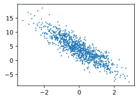

<h1>Table of Contents<span class="tocSkip"></span></h1>
<div class="toc"><ul class="toc-item"><li><span><a href="#数据操作" data-toc-modified-id="数据操作-1"><span class="toc-item-num">1&nbsp;&nbsp;</span>数据操作</a></span></li><li><span><a href="#自动求梯度" data-toc-modified-id="自动求梯度-2"><span class="toc-item-num">2&nbsp;&nbsp;</span>自动求梯度</a></span></li><li><span><a href="#线性回归模型训练" data-toc-modified-id="线性回归模型训练-3"><span class="toc-item-num">3&nbsp;&nbsp;</span>线性回归模型训练</a></span><ul class="toc-item"><li><span><a href="#生成数据集" data-toc-modified-id="生成数据集-3.1"><span class="toc-item-num">3.1&nbsp;&nbsp;</span>生成数据集</a></span></li><li><span><a href="#读取数据" data-toc-modified-id="读取数据-3.2"><span class="toc-item-num">3.2&nbsp;&nbsp;</span>读取数据</a></span></li><li><span><a href="#初始化模型参数" data-toc-modified-id="初始化模型参数-3.3"><span class="toc-item-num">3.3&nbsp;&nbsp;</span>初始化模型参数</a></span></li><li><span><a href="#定义模型" data-toc-modified-id="定义模型-3.4"><span class="toc-item-num">3.4&nbsp;&nbsp;</span>定义模型</a></span></li><li><span><a href="#定义损失函数" data-toc-modified-id="定义损失函数-3.5"><span class="toc-item-num">3.5&nbsp;&nbsp;</span>定义损失函数</a></span></li><li><span><a href="#定义优化算法" data-toc-modified-id="定义优化算法-3.6"><span class="toc-item-num">3.6&nbsp;&nbsp;</span>定义优化算法</a></span></li></ul></li></ul></div>

# 数据操作

**torch.Tensor是储存和变换数据的主要工具。类似Numpy的多维数组。**


```python
import torch
#建立5x3的未初始化的tensor
x = torch.empty(5,3)
print(x)
```

    tensor([[ 0.0000e+00,  0.0000e+00,  0.0000e+00],
            [ 0.0000e+00,  0.0000e+00,  0.0000e+00],
            [ 1.3715e-22,  1.4013e-45, -9.8971e-36],
            [ 4.5769e-41,  0.0000e+00,  0.0000e+00],
            [ 2.0437e+24,  1.0845e-19,  2.0438e+24]])


创建5x3的随机初始化的tensor


```python
x = torch.rand(5,3)
print(x)
```

    tensor([[0.0377, 0.5239, 0.3665],
            [0.5343, 0.8911, 0.8131],
            [0.3496, 0.2320, 0.2632],
            [0.1687, 0.1395, 0.6855],
            [0.9568, 0.8528, 0.0190]])


创建5x3的long型全0的tensor


```python
x = torch.zeros(5,3,dtype=torch.long)
print(x)
```

    tensor([[0, 0, 0],
            [0, 0, 0],
            [0, 0, 0],
            [0, 0, 0],
            [0, 0, 0]])


创建对角线全为1，其余为0的5x5的tensor


```python
x = torch.eye(5,5)
print(x)
```

    tensor([[1., 0., 0., 0., 0.],
            [0., 1., 0., 0., 0.],
            [0., 0., 1., 0., 0.],
            [0., 0., 0., 1., 0.],
            [0., 0., 0., 0., 1.]])


输出非零元素的下标


```python
x = torch.eye(5,5)
y = torch.nonzero(x)
print(y)
```

    tensor([[0, 0],
            [1, 1],
            [2, 2],
            [3, 3],
            [4, 4]])


# 自动求梯度


```python
import torch
x = torch.ones(1,requires_grad=True)

print(x.data) # 还是一个tensor
print(x.data.requires_grad) # 但是已经是独立于计算图之外

y = 2 * x
x.data *= 100 # 只改变了值，不会记录在计算图，所以不会影响梯度传播

y.backward()
print(x) # 更改data的值也会影响tensor的值
print(x.grad)

```

    tensor([1.])
    False
    tensor([100.], requires_grad=True)
    tensor([2.])


```python
y = torch.rand(5,3)
x = torch.randn(5,3)
print(y)
print(x)
# y = torch.rand(5,3) y=torch.randn(5,3)，一个均匀分布，一个是标准正态分布。
```

    tensor([[9.9383e-01, 9.0356e-01, 7.4393e-01],
            [7.9949e-02, 6.0414e-01, 2.8949e-01],
            [3.9186e-01, 6.4059e-01, 5.1456e-01],
            [3.4875e-04, 5.2767e-01, 3.2860e-01],
            [7.1346e-01, 1.8761e-01, 3.6088e-01]])
    tensor([[ 0.0322, -0.3712, -0.7845],
            [ 0.3891, -1.6772, -1.2448],
            [ 0.3739,  0.1798, -0.4755],
            [ 0.8202,  1.6807,  0.4838],
            [ 0.0794,  0.6200,  0.9859]])


# 线性回归模型训练

## 生成数据集

房价预测模型：$\hat{y}=x_{1} w_{1}+x_{2} w_{2}+b$，其中面积为${x_{1}}$，房龄为${x_{2}}$，售价为${y}$。<br>
生成数据集的模型：$\boldsymbol{y}=\boldsymbol{X} \boldsymbol{w}+b+\epsilon$，其中噪声项ϵ服从均值为0、标准差为0.01的正态分布。噪声代表了数据集中无意义的干扰。


```python
%matplotlib inline
import torch
from IPython import display
from matplotlib import pyplot as plt
import numpy as np
import random


#输入特征数为2，即面积（x1）和房龄（x2）
num_inputs = 2

#训练数据集样本数设为1000
num_examples = 1000

#线性回归模型真实权重w=[2,-,3.4]
true_w = [2, -3.4]

#偏差b=4.2
true_b = 4.2

#用来预测标签的两个因素叫作特征（feature）。特征用来表征样本的特点。
features = torch.randn(num_examples, num_inputs,
                       dtype=torch.float32)
# y = torch.rand(5,3) y=torch.randn(5,3)，一个均匀分布，一个是标准正态分布。

#真实售出价格叫作标签（label）
labels = true_w[0] * features[:, 0] + true_w[1] * features[:, 1] + true_b

#其中噪声项 ϵϵ 服从均值为0、标准差为0.01的正态分布。噪声代表了数据集中无意义的干扰。
labels += torch.tensor(np.random.normal(0, 0.01, size=labels.size()),
                       dtype=torch.float32)

#注意，features的每一行是一个长度为2的向量，而labels的每一行是一个长度为1的向量（标量）。

print(features[0], labels[0])

```

    tensor([-1.7786,  1.5753]) tensor(-4.7349)


绘制图像


```python
def use_svg_display():
    # 用矢量图显示
    display.set_matplotlib_formats('svg')

def set_figsize(figsize=(3.5, 2.5)):
    use_svg_display()
    # 设置图的尺寸
    plt.rcParams['figure.figsize'] = figsize

# # 在../d2lzh_pytorch里面添加上面两个函数后就可以这样导入
# import sys
# sys.path.append("..")
# from d2lzh_pytorch import * 

set_figsize()
plt.scatter(features[:, 1].numpy(), labels.numpy(), 1);

```





## 读取数据


```python
# 本函数已保存在d2lzh包中方便以后使用
def data_iter(batch_size, features, labels):
    num_examples = len(features)
    indices = list(range(num_examples))
    random.shuffle(indices)  # 样本的读取顺序是随机的
    for i in range(0, num_examples, batch_size):
        j = torch.LongTensor(indices[i: min(i + batch_size, num_examples)]) # 最后一次可能不足一个batch
        yield  features.index_select(0, j), labels.index_select(0, j)

```

>yield关键字具体方法参考：[yield关键字](http://localhost:8888/notebooks/mypython/Markdown%E7%BB%83%E4%B9%A0.ipynb#yield%E5%85%B3%E9%94%AE%E5%AD%97)

让我们读取第一个小批量数据样本并打印。每个批量的特征形状为(10, 2)，分别对应批量大小和输入个数；标签形状为批量大小。


```python
batch_size = 10

for X, y in data_iter(batch_size, features, labels):
    print(X, y)
    break

```

    tensor([[ 0.4958, -1.4800],
            [ 0.3381, -0.7492],
            [-1.2581,  0.3800],
            [ 1.5087,  1.1440],
            [-1.4728,  1.0824],
            [ 0.0201, -1.6360],
            [ 0.3747, -1.4281],
            [-1.2855,  0.3662],
            [-0.0895,  0.0717],
            [ 0.2329, -0.0848]]) tensor([10.2198,  7.4256,  0.3943,  3.3205, -2.4416,  9.7956,  9.8159,  0.3905,
             3.7688,  4.9519])


## 初始化模型参数

我们将权重初始化为0、标准差为0.01的正太随机数，偏差则初始化为0。


```python
w = torch.tensor(np.random.normal(0, 0.01, (num_inputs, 1)), dtype=torch.float32)
b = torch.zeros(1, dtype=torch.float32)
```

之后的模型训练中，需要对这些参数求梯度来迭代参数的值，因此我们要让它们的$\color{#FF3030}{requires\_grad=True}$。


```python
w.requires_grad_(requires_grad=True)
b.requires_grad_(requires_grad=True) 
```


    tensor([0.], requires_grad=True)


## 定义模型

下面是线性回归的矢量计算表达式的实现。我们使用mm函数做矩阵乘法。


```python
def linreg(X, w, b):  # 本函数已保存在d2lzh_pytorch包中方便以后使用
    return torch.mm(X, w) + b
```

## 定义损失函数

我们使用上一节描述的平方损失来定义线性回归的损失函数。在实现中，我们需要把真实值y变形成预测值y_hat的形状。以下函数返回的结果也将和y_hat的形状相同。


```python
def squared_loss(y_hat, y):  # 本函数已保存在d2lzh_pytorch包中方便以后使用
    # 注意这里返回的是向量, 另外, pytorch里的MSELoss并没有除以 2
    return (y_hat - y.view(y_hat.size())) ** 2 / 2
```

## 定义优化算法


```python

```
